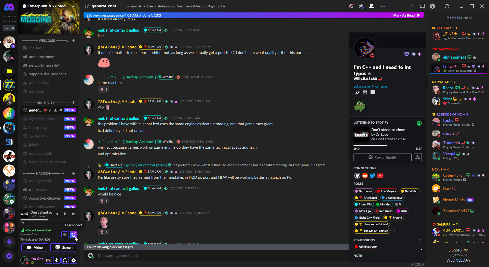

# Omega for BetterDiscord
Darker version of Discord, with beautiful gradient accents.

## Install
 - Grab `Omega.theme.css` from the [releases](https://github.com/Willy-JL/Omega-Theme/releases) section
 - Put it in your BetterDiscord themes folder
   - Usually located at `%appdata%\BetterDiscord\themes`
   - You can also go into `Discord settings > Themes > Open Themes Folder`
- Go into `Discord settings > Themes`, here find Omega and enable it
- The theme will auto update by itself anytime I make changes to it

## Credits
[Codedotspectra](https://codedotspectra.me/)'s [Nocturnal](https://github.com/codedotspectra/themes/blob/master/nocturnal/nocturnal.theme.css) for some of the inspiration (I am aware of the license, though this is not a simple edit, I fully wrote everything myself only taking a few design inspirations)
